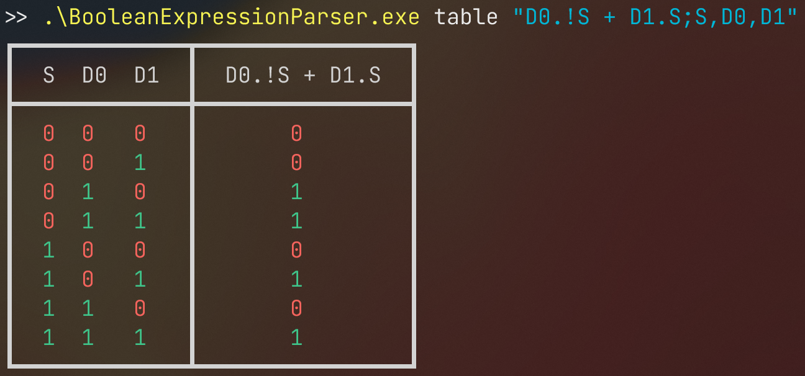

# Boolean Expression Parser <!-- omit in toc -->

A simple boolean expression parser written in C#. It parses boolean expressions and prints out a truth table for each expression.


## Contents <!-- omit in toc -->

- [Running](#running)
- [Building](#building)
- [Display](#display)
- [Usage](#usage)
  - [Truth table generation](#truth-table-generation)
- [Expressions](#expressions)
- [Variables](#variables)
- [How it works](#how-it-works)
  - [1. Tokenisation](#1-tokenisation)
  - [2. Parsing](#2-parsing)
  - [3. AST](#3-ast)
  - [4. Evaluation](#4-evaluation)
- [Example expressions](#example-expressions)
- [Roadmap](#roadmap)
- [Found an issue?](#found-an-issue)


## Running

After downloading a release from the Releases section to the right, you can run the program on either Windows or Linux by running `BooleanExpressionParser.exe` or `BooleanExpressionParser` in the terminal respectively. Note, you'll need .NET 7 installed on your machine to run the program.


## Building

To build the project, you'll need .NET 7 installed. You can then build the project with `dotnet build` or run it with `dotnet run`. Alternatively, you can open the project in Visual Studio or Visual Studio Code, the latter of which has config in the repo.


## Display

The application displays an intuitive, coloured truth table output for each boolean expression:




## Usage

### Truth table generation
`./BooleanExpressionParser table <expression(s)>`
#### Arguments: <!-- omit in toc -->
  - <expression(s)> The boolean expression(s) to evaluate
#### Options: <!-- omit in toc -->
  - -t, --true <true> Character to use for true values in the truth table. [default: 1]
  - -f, --false <false> Character to use for false values in the truth table. [default: 0]
  - -c, --colour-mode, --color-mode <colour-mode> Colour mode to use for the truth table. [default: Foreground]  [possible values: [Ff]oreground, [Bb]ackground, [Nn]one]
  - --true-colour, --true-color <true-colour> Colour to use for true values in the truth table. [default: green]  [possible values: 16 ANSI colours, hex string, rgb string]
  - --false-colour, --false-color <false-colour> Colour to use for false values in the truth table. [default: red]  [possible values: 16 ANSI colours, hex string, rgb string]

More usage options to be implemented in the future.

For help, run `./BooleanExpressionParser --help`. For help with a specific command, run `./BooleanExpressionParser <command> --help`.


## Expressions

Shown below is a list of supported operators. Each operator's aliases are listed in brackets.

  - AND (`&`, `.`)
  - OR (`|`, `+`)
  - NOT (`!`, `¬`)
  - XOR
  - NAND
  - NOR
  - XNOR
  - IMPLIES (`=>`)

Of course, you can also use brackets to group expressions. Every type of bracket can be used, which may help distinguish groupings: `()` `[]` `{}`


## Variables

Any characters in an expression which arent operators or brackets are considered variables. The parser will automatically generate a truth table for each variable. Variables can be several characters long, which allows for numbered variables (`A1`, `A_2`, etc.).

To provide an order in which the variables should be printed, give a comma separated list of variables after your expression, separating these parts with a semicolon (`;`). If this isn't given, the truth table is generated in the order the variables are found in the expression.

For example:
- The expression "D0.!S + D1.S" would generate a truth table ordered D0, D1, S.
- The expression "D0.!S + D1.S;S,D0,D1" would generate a truth table ordered S, D0, D1.


## How it works

### 1. Tokenisation
   - Input is split into tokens. These tokens are internal representations of the input.
   - Tokens are either operators, variables, or brackets.
   - For example, the input `A & ! B` would be tokenised into [`A`, `AND`, `NOT`, `B`].


### 2. Parsing
   - Tokens are parsed into prefix or Polish notation, using the (slightly modified) Shunting-yard algorithm.
   - Prefix notation removes the need for brackets, and makes it easier to evaluate the expression. In this notation, the operator is placed before the operands (rather than in between them).
   - Our tokenised list, [`A`, `AND`, `NOT`, `B`] would be parsed into [`A`, `B`, `NOT`, `AND`].


### 3. AST
   - The parsed tokens are then converted into an AST (Abstract Syntax Tree). This is so that the expression can be evaluated and easily traversed.
   - An AST consists of several nodes, each with children nodes (0, 1, or 2 depending on its type). Each node represents an operator or variable.
   - Our parsed list, [`A`, `B`, `NOT`, `AND`], would be converted into the following AST:
      ```
      AND
      ├── A
      └── NOT
          └── B
      ```


### 4. Evaluation
   - Finally, the AST is evaluated, and a truth table is printed out for the expression.
   - Evaluation simply traverses the AST and evaluates each node recursively, using the values of its children.
   - Each expression is evaluated using every possible set of inputs which is then collated into a truth table.


## Example expressions

- `A & B`
  - A simple AND gate
- `A OR B`
  - A simple OR gate
- `!S . D_0 + D_1 . S`
  - A 2-1 multiplexer
- `(!S0 AND ¬S1 . D0) | (NOT{S0} . S1 . D1) + (S0 . {¬S1 & D2}) OR [S0 . S1 AND D3]`
  - A 4-1 multiplexer, using several aliases for operators and brackets


## Roadmap

- [x] Implement basic expression parsing and evaluation
- [x] Implement truth table generation and display
- [x] Improve console output with colours
- [x] Implement command line arguments
- [ ] Add raw output options
  - [ ] Output prefix notation
  - [ ] Output specific output for given variables
  - [ ] Output machine-readable truth table
- [ ] Create UI for the application, either web-based or desktop-based


## Found an issue?

If you've found an issue, like an expression that casuses a crash or an incorrectly parsed expression, please open an issue on GitHub. Please include the expression that caused the issue, thank you!